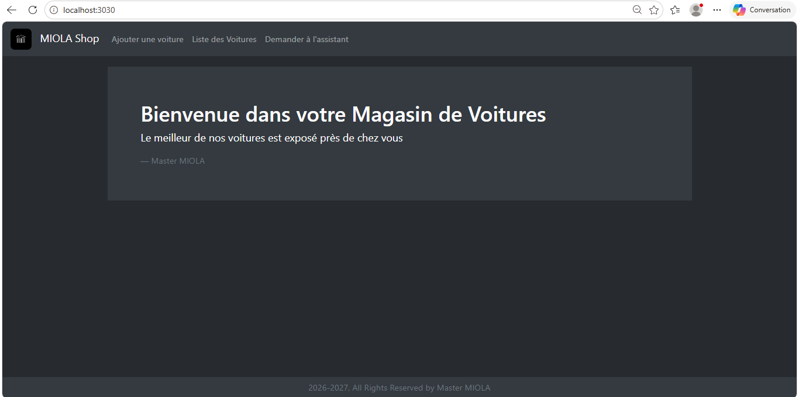
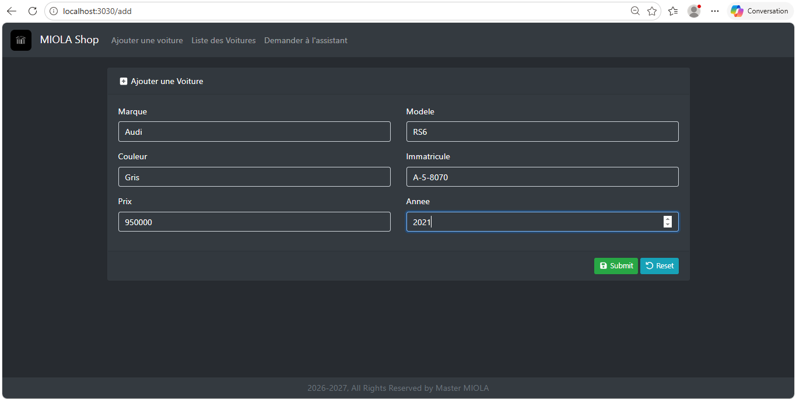
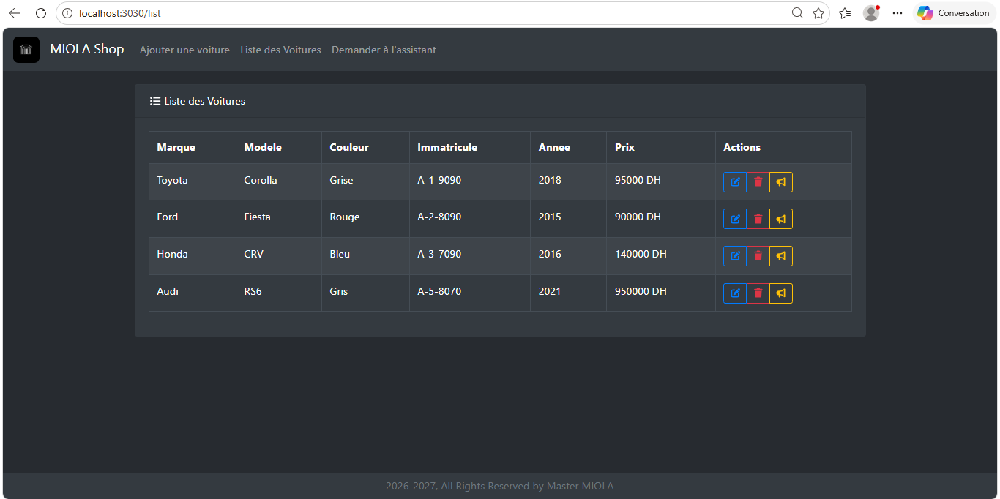
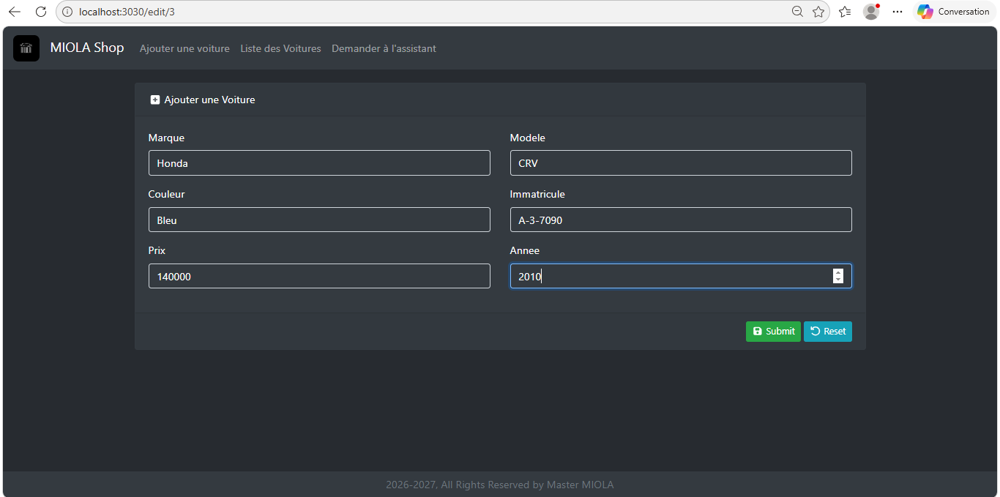
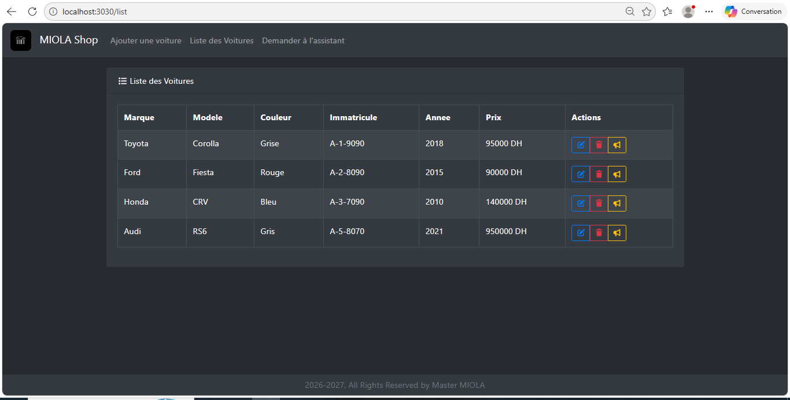
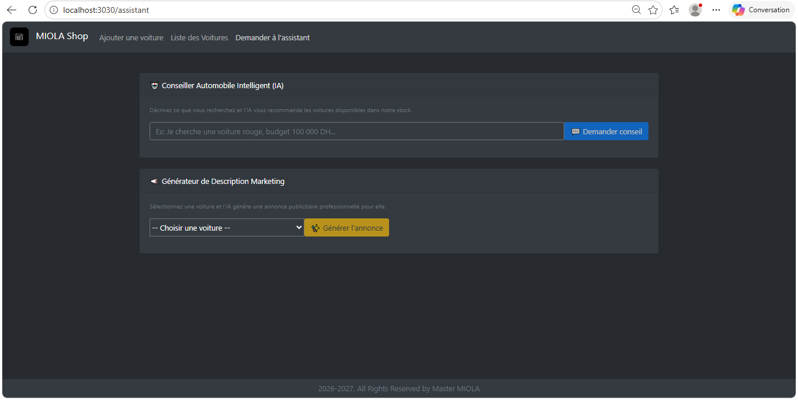
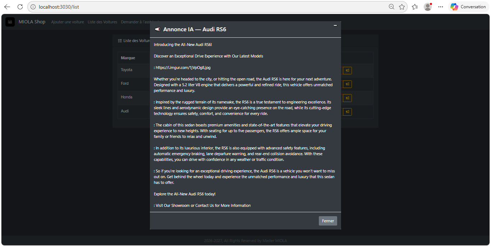

# MiolaCar — Système de Gestion Automobile avec Intelligence Artificielle

MiolaCar est une application web full-stack combinant la **gestion de voitures** avec un **assistant intelligent alimenté par IA** ainsi qu’un **générateur automatique d’annonces marketing**.  
L’application permet de gérer un stock de véhicules, obtenir des recommandations intelligentes et générer automatiquement des descriptions publicitaires professionnelles grâce à une IA locale utilisant **Ollama**.

---

# Aperçu de l’Application

## Page d’accueil


## Gestion des voitures

### L'ajout d'une voiture


### La liste des voitures


### La modification d'une voiture


### La liste des voitures avec celle modifier


## Assistant IA


## Générateur Marketing


---

# Fonctionnalités

## Assistant Automobile Intelligent
- Posez des questions en langage naturel
- Obtenez des recommandations selon :
  - le budget
  - la couleur
  - les préférences
  - les critères utilisateur
- L’IA répond uniquement à partir du stock disponible en base de données

### Exemple :
> “Je cherche une voiture rouge avec un budget de 100 000 DH”

---

## Générateur d’Annonce Marketing IA
- Génération automatique d’annonces publicitaires
- Texte professionnel et convaincant
- Mise en avant des qualités du véhicule
- Génération en un clic

### Exemple :
> “Découvrez cette magnifique Honda CRV 2016, élégante, fiable et idéale pour les longs trajets…”

---

## Gestion Complète des Voitures
- Ajouter une voiture
- Modifier une voiture
- Supprimer une voiture
- Afficher la liste des véhicules

---

## Intelligence Artificielle Locale
- Utilisation de **Ollama**
- Modèle IA local (**TinyLlama**)
- Aucun appel à une API externe
- Fonctionne entièrement en local

---

# Technologies Utilisées

## Frontend
- React.js
- Bootstrap

## Backend
- Spring Boot
- Spring AI

## Base de données
- MariaDB

## Intelligence Artificielle
- Ollama
- TinyLlama

## Infrastructure
- Docker
- Docker Compose

---

# Architecture du Projet

```text
Frontend React
       ↓
Backend Spring Boot REST API
       ↓
MariaDB
       ↓
Ollama (IA locale)
````

---

# Lancement du Projet

## Cloner le projet

```bash
git clone https://github.com/votre-username/miolacar.git
cd miolacar
```

---

## Démarrer Docker

Assurez-vous que **Docker Desktop** est bien lancé.

---

## Lancer l’application

```bash
docker compose up --build
```

---

# Accès aux Services

| Service        | URL                                                    |
| -------------- | ------------------------------------------------------ |
| Frontend React | [http://localhost:3030](http://localhost:3030)         |
| Backend Spring | [http://localhost:8080/api](http://localhost:8080/api) |
| Ollama         | [http://localhost:11434](http://localhost:11434)       |

---

# Endpoints API

## Gestion des voitures

| Méthode | Endpoint             | Description           |
| ------- | -------------------- | --------------------- |
| GET     | `/api/voitures`      | Liste des voitures    |
| POST    | `/api/voitures`      | Ajouter une voiture   |
| PUT     | `/api/voitures/{id}` | Modifier une voiture  |
| DELETE  | `/api/voitures/{id}` | Supprimer une voiture |

---

## Intelligence Artificielle

| Méthode | Endpoint                       | Description             |
| ------- | ------------------------------ | ----------------------- |
| POST    | `/api/voitures/assistant`      | Assistant automobile IA |
| GET     | `/api/voitures/{id}/marketing` | Générer une annonce IA  |

---

# Variables Importantes

Dans le `docker-compose.yml` :

```env
SPRING_DATASOURCE_URL=jdbc:mariadb://mariadb:3306/springboot
SPRING_DATASOURCE_USERNAME=spring
SPRING_DATASOURCE_PASSWORD=spring

SPRING_AI_OLLAMA_BASE_URL=http://ollama:11434
SPRING_AI_OLLAMA_CHAT_MODEL=tinyllama
```

---

# Services Docker

| Service      | Description                          |
| ------------ | ------------------------------------ |
| mariadb      | Base de données                      |
| backend      | API Spring Boot                      |
| frontend     | Interface React                      |
| ollama       | Serveur IA local                     |
| ollama-setup | Téléchargement automatique du modèle |

---

# Fonctionnement de l’IA

## Assistant IA

L’application :

1. Récupère toutes les voitures de la base
2. Construit un catalogue dynamique
3. Envoie le catalogue + la demande utilisateur au modèle IA
4. Génère une recommandation intelligente

---

## Générateur Marketing

L’IA reçoit :

* marque
* modèle
* couleur
* année
* informations du véhicule

Puis génère automatiquement :

* une annonce publicitaire
* un texte vendeur
* une description marketing professionnelle

---

# Objectifs du Projet

Ce projet démontre :

* l’intégration de l’IA dans une application métier
* l’utilisation d’un LLM local avec Ollama
* le développement full-stack moderne
* l’architecture microservices avec Docker
* l’automatisation marketing par intelligence artificielle

---

# Cas d’Utilisation

* Concession automobile
* Assistant de vente intelligent
* Génération automatique d’annonces
* Projet pédagogique IA + Full Stack

---

# Améliorations Futures

* Authentification utilisateurs/admin
* Génération d’images IA
* Support multilingue
* Déploiement Cloud
* Tableau de bord analytique
* Streaming des réponses IA

---

# Notes Importantes

* Le premier lancement peut prendre plusieurs minutes
  (téléchargement du modèle IA TinyLlama ~600MB)

* Docker doit être lancé avant le démarrage

* Les ports suivants doivent être disponibles :

  * 3030 → Frontend
  * 8080 → Backend
  * 3306 → MariaDB
  * 11434 → Ollama

---

# Licence

Projet open-source sous licence MIT.

---

# Auteur

Aya Taki

Projet développé dans le cadre d’un apprentissage :

* Full Stack Development
* Intelligence Artificielle
* Docker & Microservices
* Intégration de modèles LLM locaux

```
